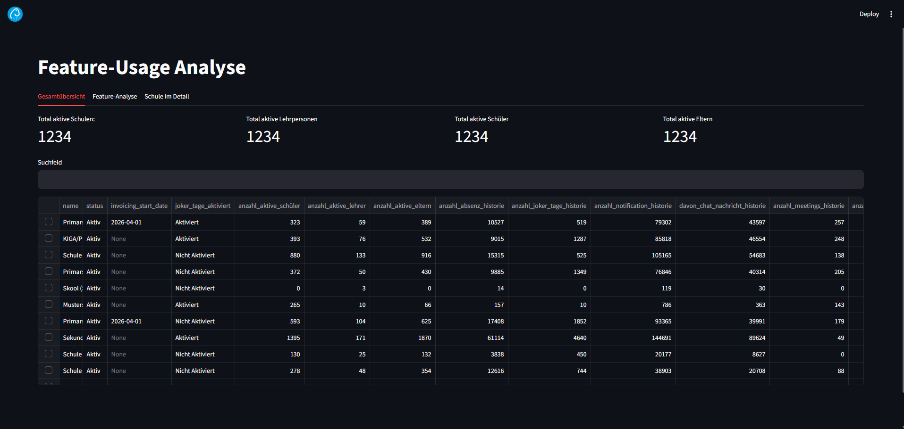
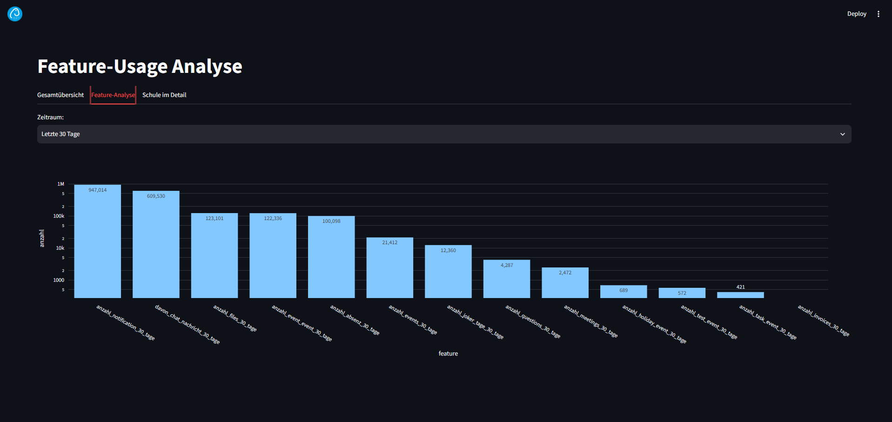
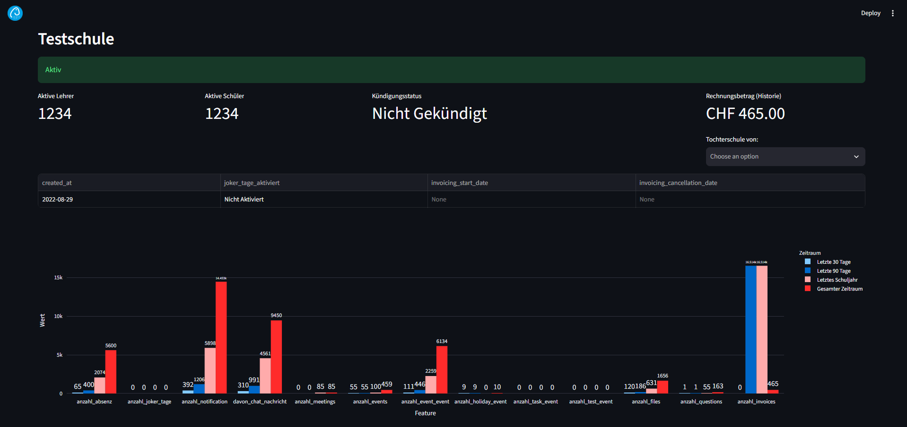

# Feature Usage Analysis

Data pipeline and Streamlit dashboard for analyzing school-level feature usage from the `klapp-prod` MongoDB database.

## Suggested repository description

Feature usage analytics for schools with MongoDB aggregation pipelines and a Streamlit dashboard.

## Repository structure

- `src/lib/pipelines.py` – MongoDB aggregation pipelines per feature and timeframe.
- `src/lib/helpers.py` – DataFrame merge and pipeline helper utilities.
- `src/dashboard/snapshot.py` – Extracts data from MongoDB and writes snapshot files.
- `src/dashboard/app.py` – Streamlit dashboard for overview and per-school analysis.
- `notebooks/api_analysis.ipynb` – Exploratory notebook.

## Prerequisites

- Python 3.10+
- Access to the `klapp-prod` MongoDB instance
- A `.env` file containing:

```env
mongo_uri=<your_mongodb_connection_string>
```

## Run data snapshot generation

From the repository root:

```bash
python src/dashboard/snapshot.py
```

This generates:

- `data/snapshot.parquet`
- `data/mother_daughter.json`

## Run the dashboard

From `src/dashboard`:

```bash
streamlit run app.py
```

## Sample dashboard images

### Overview



### Feature view



### Detailed view



## Notes

- Time windows used in aggregations include 30 days, 90 days, last school year and the whole history.
- Output and UI labels are currently German.
